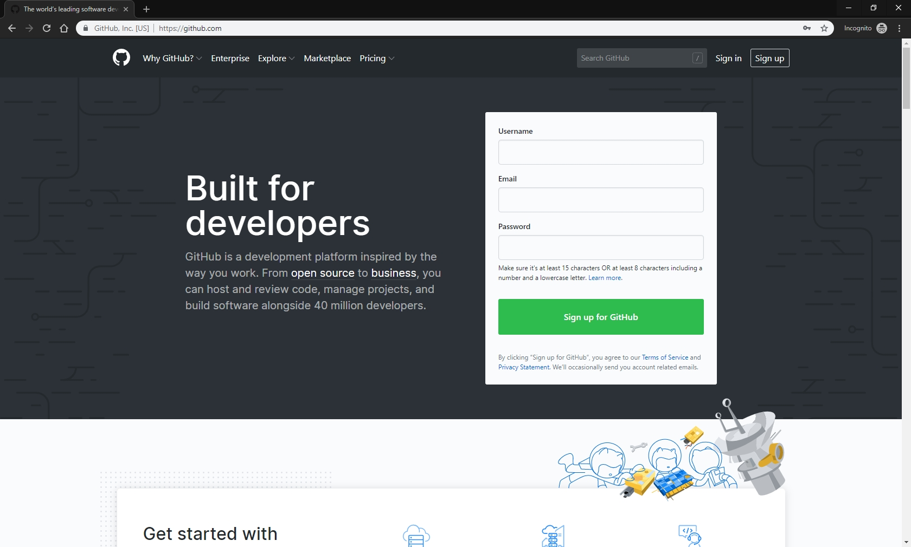
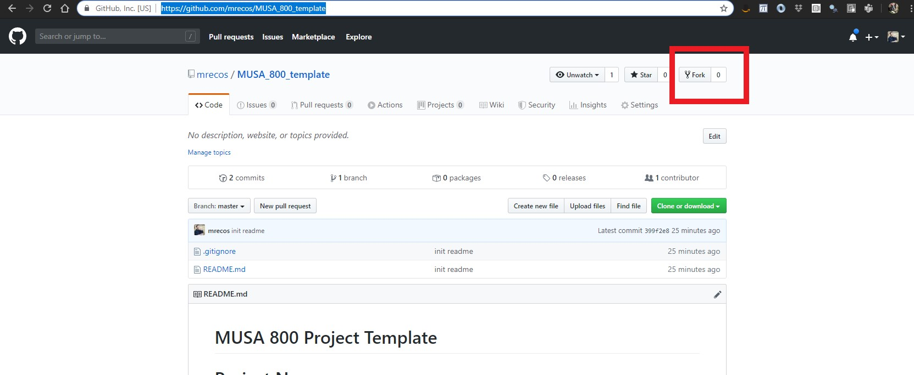
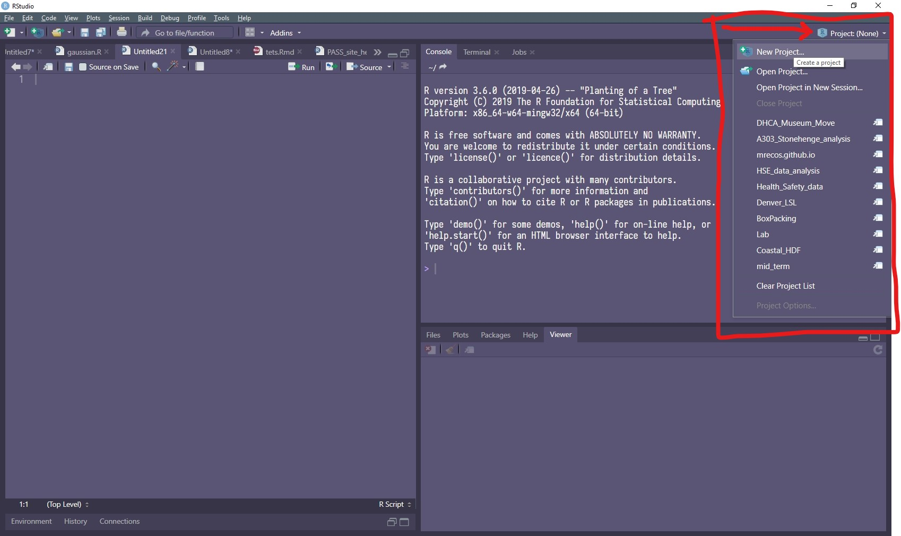
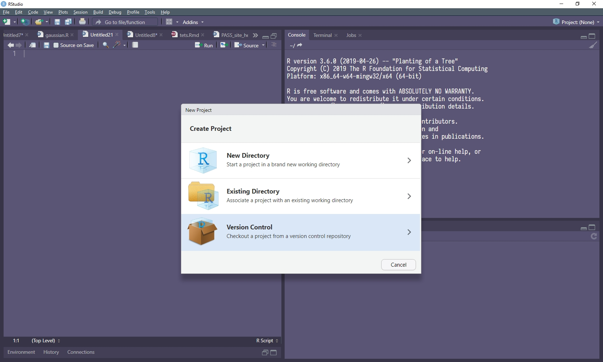
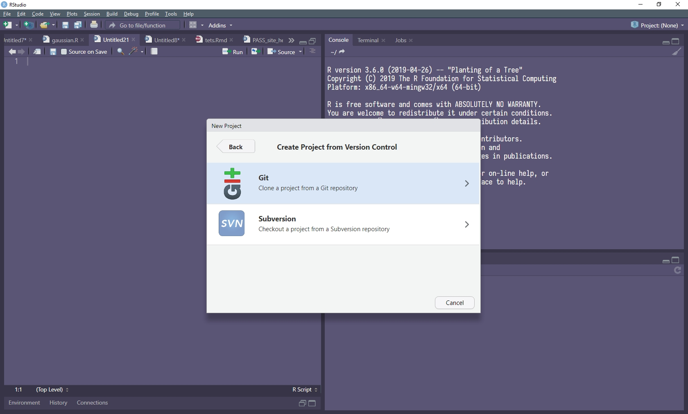
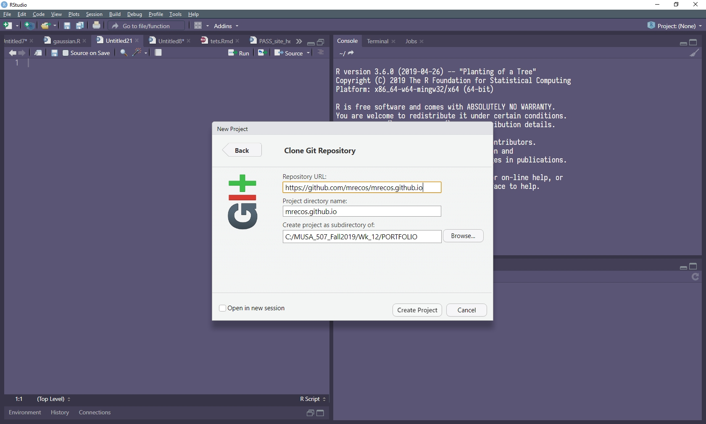
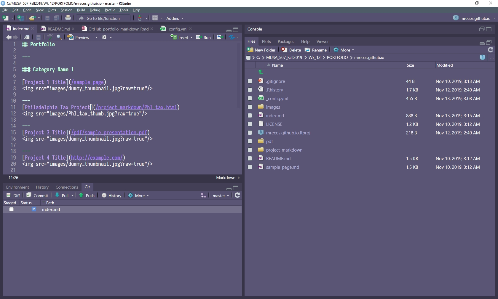
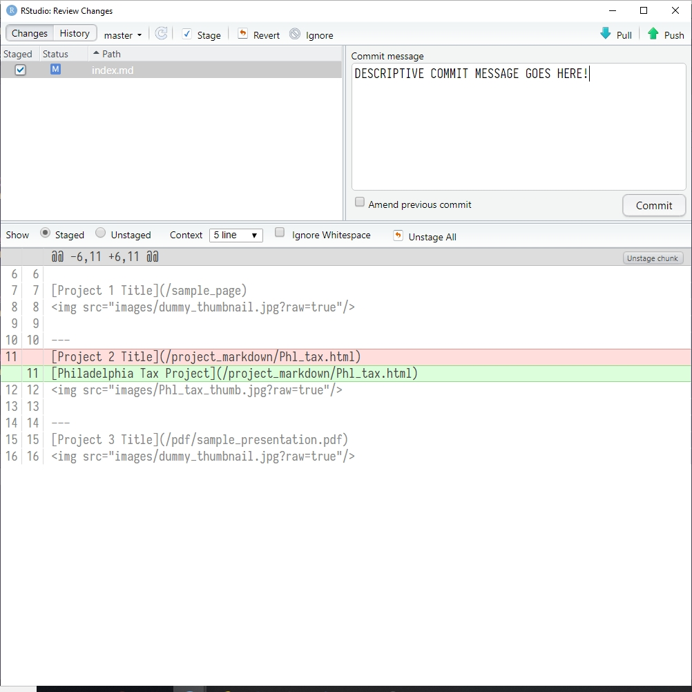

```{r setup, include=FALSE}
knitr::opts_chunk$set(echo = TRUE)
```
## A Project Portfolio with GitHub Pages

This markdown is about making a simple MUSA 800 Practicum project on GitHub using Markdown and Rstudio. Requirements for this are a GitHub account, Git command line tool installed on your computer, Rstudio, and some knowledge of markdown and perhaps HTML. Aside from some preliminary setup, your work will be about editing an `README.md` document and, if you choose, committing you project work to GitHub. We will walk through all of these steps. 

## GitHub

GitHub is a platform for code version control and collaboration. The `Git` in `GitHub` refers to a versioning protocol that allows a user or team to keep track of who changes what files, when and where. It is a very powerful protocol and GitHub harnesses that power into an easy to use cloud platform. Fortunately, GitHub makes a lot of the complex Git actions (e.g. Push, Pull, Commit, etc...) simple and intuitive. Combines with RStudio, the basics of Git version control are nearly as simple as pushing a button.
Learning Git and GitHub is a skill that is very useful for controlling your own code and collaborating with others in this class and industry. Below are some links to help get familiar with what Git and GitHub have to offer.


### Introductions to GitHub:

- [Using Git with RStudio](https://jennybc.github.io/2014-05-12-ubc/ubc-r/session03_git.html)

- [Introduction to Github for Data Scientists](https://towardsdatascience.com/introduction-to-github-for-data-scientists-2cf8b9b25fba)

- [Why Git And How To Use Git As A Data Scientist](https://towardsdatascience.com/why-git-and-how-to-use-git-as-a-data-scientist-4fa2d3bdc197)

- [An introduction to Git and how to use it with RStudio](https://r-bio.github.io/intro-git-rstudio/)


## Steps for setting up RStudio and GitHub

The steps below cover the entire process for how to create a GitHub project accesible within RStudio. 

1.  Make github account
2.  Install git on your computer: see links above or https://git-scm.com/downloads
3.  Configure git in Rstudio: Click `Tools -> Global Options -> Git/SVN`
4.  Fork: https://github.com/mrecos/MUSA_800_template
5.  Create version control R project
6.  Edit `README.md` to reflect a portfolio landing page
7.  Keep your `README.md` up to data with your project pin-ups


#### Step 1 - Make GitHub account

Go to https://github.com/



#### Step 2 - Install Git

A program called `Git` is the underlying technology that allows for Rstudio and GitHub to communicate and perform version control. Git is considered a protocol as it defines how other programs communicate version control. Before Rstudio will work with version control, you need to install `Git` on your computer. You can visit the [Git website](https://git-scm.com/downloads) and also check out  [Using Git with RStudio](https://jennybc.github.io/2014-05-12-ubc/ubc-r/session03_git.html) for some helpful instructions. It is usually a pretty easy install and you will want to accept the default settings most likely. Note that the Git protocol is very powerful and has many more features than the simple use case here.

#### Step 3 - Configure Rstudio

There is a final setup step required to let Rstudio know that you have installed Git and where to look for it. In Rstudio click `Tools -> Global Options -> Git/SVN`. The check box for "Enable version control interface for Rstudio projects" should be checked and the box for "Git executable" should be the location in which in installed Git in the previous step.


#### Step 4 - "Fork" the Repo

The term "fork" means to copy a GitHub code repository (aka "repo") to your account. Your new repo and the original will be linked, but they will not update to each other unless specifically told to do so via a "pull request". Forking the [MUSA 800 Practicum Template](https://github.com/mrecos/MUSA_800_template). This action will duplicate the template repository to your GutHub account. The "fork" button is in the upper-right hand corner of the original repo.




#### Step 5 - Create Version Controlled GitHub Rstudio Project

You can interact with your GitHub account in a number of ways, but we will use Rstudio as the means for editing and managing out portfolio. To setup Rstudio to do so, you need to create a `New Project`




Rstudio has a few different project formats, but you will pick the `Version Control` project to let Rstudio know you want to create a project from a GitHub repo.




There are two options for version controlled Rstudio projects, but we will chose `Git`.



Cut/Paste the URL to your version of the portfolio repo into the "Repository URL", the project name will populate as username. Finally, choose a directory to store your repo/files/code and make sure it is easy enough to navigate to; you will go there a bunch. Once you hit `Create Project`, Rstudio will go to that URL and copy all of the code to your hard drive; this is called `cloning` a repo.



If everything went well, you will have a `Git` tab on your "Environments, History, etc..." tab in Rstudio (mine is lower-left, but yours may not be).



#### Step 6 - Make Changes and `Commit`!

The two main git operations we will use are `commit` and `push`. `Commit` means to save changes in files to a special git database on your local hard drive. The the `push` command communicates these changes with GitHub, lets you know if all the files sync up, and if all is clear it uploads the changed files. This is how the version control aspect of GitHub work. 

Open the `README.md` from your repo/project in Rstudio and start making some changes. This file is written in markdown and will be the landing page for your project repo from the GitHub point of view. Use the same types of markdown syntax as you do with Rmarkdown, but note that R code blocks will not be evaluated in a basic *.md document.


Once you make some edits, go to the `Git` tab in Rstudio and you will see the names of the files that have changed. Click on the `Commit` button to stage your changes to be pushed to the GitHub. The image below is the staging area where you will need to click on the check-box next to each file that you want to commit the changes from. On the upper-right is a place to write a commit message. Make use of this space to write detailed messages. Click the `Commit` button.




Once committed, click the `Push` button to send it to the server. You will likely have to type in your GitHub username and password each time you push code. I status message will appear and hopefully everything goes well!


#### Step 8 - Go to your GitHub repo

If all went well in step 7, you should be able to go to your GitHub repo and see the new changes to the `README` after you refresh your browser. The `README` will be a living progress report for your project. Remeber, that this is a live repo, so *do not* put any sensitive data or material in this space!


#### Step 11 - Keep it up to date!

Continue to iterate the above steps and add to your project `README` as you move through the stages of your project.
